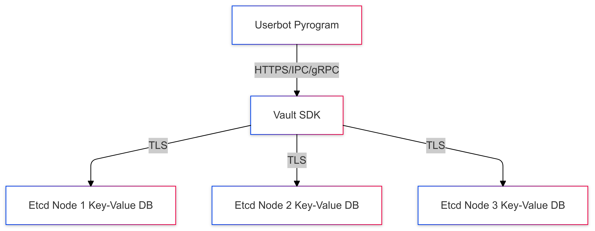

# Learn-2-Learn (L2L)

## Overview

Learn-2-Learn is a modular, scalable platform designed to facilitate collaborative learning through tools like real-time discussions, shared AI-generated resources, and personalized learning paths powered by AI-driven assistance. The project integrates FastAPI, Django, Telethon, and modern AI tools like OpenAI models to create a seamless, interactive experience.

The platform leverages advanced techniques for secure data storage and transmission, focusing on encryption, peer-to-peer communication, and dynamic scalability. A standout feature is the use of isolated bots for service communication. Each service (e.g., Vault, Django) operates with its own dedicated Telegram bot, deployed in isolated Kubernetes pods. These bots handle inter-service communication securely and asynchronously.

By mastering these tools and frameworks, the project aims to unlock innovative AI-driven solutions, from social media content generation to secure API management, within a collaborative ecosystem.

---

## Features

- **Service Bots:** Isolated Telegram bots for secure inter-service communication (e.g., Vault and Django bots).
- **User Management:** Custom Django user model with advanced fields like `telegram_id` and `telegram_username`.
- **Vault Integration:** Secure secrets storage and management using HashiCorp Vault.
- **Elasticsearch Logging:** Centralized logging for enhanced traceability and debugging.
- **Telegram Bot Integration:** Manage user interactions and commands through Telegram bots.
- **WebSocket Communication:** Real-time communication between Telegram and the backend.
- **Image Generation:** AI-powered image generation using OpenAI API.
- **Extensibility:** Modular architecture for easy addition of new features.
- **Multi-database Support:** Integration with PostgreSQL, Redis, CouchDB, and PouchDB for optimized data handling.
- **Asynchronous Processing:** Built-in support for async operations, improving performance.
- **Dynamic Configuration:** Environment-based settings for development and production.

---
## Project Structure

```
learn-2-learn/
├── django_fst/               # Django Fast backend (currently considering the most convenient way for the project to integrate with Telegram and FastAPI to achieve asynchronous communication)
│   ├── core/                 
│   ├── user_management/      # Custom user model and management features based on Telegram user data.
│   └── manage.py             
├── telega/                   # Centralized integration with Vault for manage Clients secret between the APIs. Contains Telegram bot logic, including handlers for user interactions and commands.
├── fst_on_demand/            # FastAPI modules for additional microservices which will be run on the provider's cloud cluster for AI training.
├── ansible/                  
├── k8s/                      
├── Dockerfile                
└── requirements.txt          
```
---

### */telega/*


---

## Tech Stack

- **Backend:** Django ORM, FastAPI, Telegram API
- **Frontend:** HTML5 (future integration with Telegram Web Apps planned) | Nginx with Apache
- **Database:** PostgreSQL, CouchDB (future), Etcd
- **Tools:** Vault, Ingress, Helm Charts, Ansible, Redis, Celery, Docker, Kubernetes
- **Languages:** Python

---
### *Infrastructure as a sketch pattern*


---

### **Implementation Goals**
- **API Management Automation:** Use Kubernetes for application orchestration (Django, FastAPI) and Ansible for configuration automation.
- **Service Bots:** Deploy isolated Telegram bots in Kubernetes pods for secure inter-service communication.
- **Secrets Management:** Integrate HashiCorp Vault with Kubernetes for secure secrets management and dynamic updates.
- **Configuration Centralization:** Unified mechanism for managing settings across services.
- **Scalability:** Enable dynamic scaling of services based on usage patterns.

---

### **Kubernetes Deployment Plan**

#### **Services Overview**
- **Django Pod:** Handles backend logic and database operations.
- **FastAPI Pod:** Serves lightweight asynchronous APIs.
- **Vault Pod:** Manages secrets and integrates with the backend for dynamic configuration.
- **Telegram Bots:** Each bot runs in a dedicated pod to securely communicate with its corresponding service.

---

#### **Automation Workflow**
1. **Vault Initialization:**
   - Playbook: `init_vault_secrets.yaml`
   - Initializes Vault and stores keys for unsealing.
2. **Deployment to Kubernetes:**
   - Playbook: `deploy_k8s.yaml`
   - Deploys Kubernetes manifests for services and bots.
3. **Secrets Management:**
   - Playbook: `manage_secrets.yaml`
   - Updates secrets dynamically for all services.

---

### **Service Bots**

#### **Vault Bot**
- Manages unsealing and status checks for Vault.
- Ensures secure integration with other services.

#### **Django Bot**
- Handles user interaction, service health checks, and command-driven operations.

#### **Bot Architecture**
Each bot is deployed as a pod with a minimal Docker image and uses Helm Charts for easy scaling and configuration management.

---

## Endpoint for pinging 🗺
- **Free-thinker🤓** Beaver (🔗🇺🇦🇵🇱 [@b3av3r](https://t.me/b3av3r))