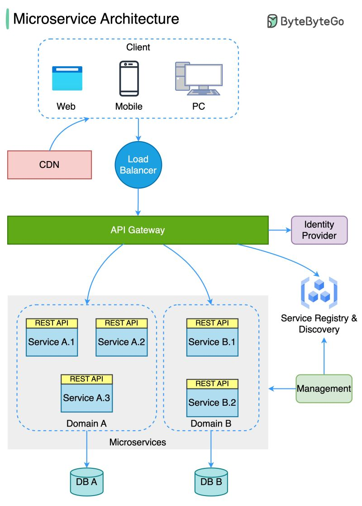

# Learn-2-Learn (L2L)
*Currently in the planning stage, you will only find some theory here*

## Overview

Learn-2-Learn is a modular, scalable platform designed to facilitate collaborative learning through tools like real-time discussions, shared AI-generated resources, and personalized learning paths powered by AI-driven assistance. The project integrates FastAPI, Django, Telethon, and modern AI tools like OpenAI models to create a seamless, interactive experience.

The platform leverages advanced techniques for secure data storage and transmission, focusing on encryption, peer-to-peer communication, and dynamic scalability. A standout feature is the use of isolated bots for service communication. Each service (e.g., Vault, Django) operates with its own dedicated Telegram bot, deployed in isolated Kubernetes pods. These bots handle inter-service communication securely and asynchronously.

By mastering these tools and frameworks, the project aims to unlock innovative AI-driven solutions, from social media content generation to secure API management, within a collaborative ecosystem.

[secrets_roadmap](docs/secrets_roadmap.md)

---

## Features

- **Service Bots:** Isolated Telegram bots for secure inter-service communication (e.g., Vault and Django bots).
- **User Management:** Custom Django user model with advanced fields like `telegram_id` and `telegram_username`.
- **Vault Integration:** Secure secrets storage and management using HashiCorp Vault.
- **Elasticsearch Logging:** Centralized logging for enhanced traceability and debugging.
- **Telegram Bot Integration:** Manage user interactions and commands through Telegram bots.
- **WebSocket Communication:** Real-time communication between Telegram and the backend.
- **Image Generation:** AI-powered image generation using OpenAI API.
- **Extensibility:** Modular architecture for easy addition of new features.
- **Multi-database Support:** Integration with PostgreSQL, Redis, CouchDB, and PouchDB for optimized data handling.
- **Asynchronous Processing:** Built-in support for async operations, improving performance.
- **Dynamic Configuration:** Environment-based settings for development and production.

---

## Tech Stack

- **Backend:** Django ORM, FastAPI, Telegram API
- **Frontend:** HTML5 (future integration with Telegram Web Apps planned) | Nginx with Apache
- **Database:** PostgreSQL, CouchDB (future), IPFS
- **Tools:** Vault, Web3, Ingress, Helm Charts, Redis, Celery, Docker, Kubernetes
- **Languages:** Python

---
### *Infrastructure as a sketch pattern*

---

### **Implementation Goals**
- **API Management Automation:** Use Kubernetes for application orchestration (Django, FastAPI) and Ansible for configuration automation.
- **Service Bots:** Deploy isolated Telegram bots in Kubernetes pods for secure inter-service communication.
- **Secrets Management:** Integrate HashiCorp Vault with Kubernetes for secure secrets management and dynamic updates.
- **Configuration Centralization:** Unified mechanism for managing settings across services.
- **Scalability:** Enable dynamic scaling of services based on usage patterns.

---
### **Services Replaced by Telegram Userbot**

#### 1. **Ingress**
- **Replaced Functionality:**
  - Traditional ingress services handle routing and load balancing for APIs.
- **Userbot Implementation:**
  - The userbot simplifies API interaction by directly managing service communication. 
  - Example: The userbot triggers Django service startup and monitors its availability via health endpoints.

#### 2. **Secrets Management via Kubernetes Secrets**
- **Replaced Functionality:**
  - Kubernetes Secrets are commonly used for managing sensitive data.
- **Userbot Implementation:**
  - Secrets are fetched dynamically from Vault by the userbot and stored temporarily in Redis or injected as environment variables directly into running containers.

#### 3. **Monitoring Tools (e.g., Prometheus, Grafana)**
- **Replaced Functionality:**
  - Conventional monitoring tools visualize service health and metrics.
- **Userbot Implementation:**
  - The userbot periodically pings service endpoints (e.g., `/health`) and logs the results.
  - Alerts can be sent to a Telegram chat for real-time monitoring.

#### 4. **Configuration Management Tools**
- **Replaced Functionality:**
  - Tools like Ansible or Terraform manage dynamic service configurations.
- **Userbot Implementation:**
  - The userbot acts as the configuration agent by:
    - Fetching secrets from Vault.
    - Injecting environment variables or creating runtime configurations for Django and FastAPI.

---

### **Workflow: How the Telegram Userbot Replaces Services**

1. **Initialization**
   - The userbot starts with basic credentials (`TG_API_ID`, `TG_API_HASH`).
   - Establishes a secure connection with Vault to authenticate and fetch tokens.

2. **Secrets Management**
   - Secrets are retrieved from Vault using the Vault SDK and temporarily stored in Redis.
   - Secrets are injected into services dynamically, reducing the need for static configurations.

3. **Service Startup**
   - The userbot triggers service containers (e.g., Django, FastAPI) using Kubernetes or Docker APIs.
   - Secrets and configurations are passed to the services during runtime.

4. **Monitoring and Alerts**
   - The userbot periodically queries health endpoints of services (e.g., `/health`, `/metrics`).
   - Alerts or status updates are sent to a Telegram chat for real-time visibility.

---

### **Benefits of Using the Telegram Userbot**

1. **Security**
   - Eliminates persistent storage of secrets in files or environment variables.
   - Reduces attack surface by centralizing secrets management in Vault.

2. **Cost Efficiency**
   - Replaces expensive infrastructure services (e.g., Ingress, Prometheus) with a lightweight, single-threaded bot.

3. **Simplicity**
   - Centralizes orchestration, secrets management, and monitoring in a single service.

4. **Flexibility**
   - Easily integrates with existing Telegram workflows.
   - Adaptable to various service configurations and environments.

---

### **Potential Limitations and Mitigations**

#### **1. Single Point of Failure**
   - **Issue:** The userbot is central to the architecture, and its failure could disrupt operations.
   - **Mitigation:** Deploy the bot in a highly available setup (e.g., Kubernetes pod with restart policies).

#### **2. Latency in Secrets Management**
   - **Issue:** Fetching secrets dynamically may introduce delays.
   - **Mitigation:** Utilize Redis for caching frequently accessed secrets.

#### **3. Scalability Concerns**
   - **Issue:** A single bot may struggle with heavy traffic or multiple service requests.
   - **Mitigation:** Deploy multiple instances of the bot, with each managing a subset of services.

---

## Endpoint for pinging 🗺
- **Free-thinker🤓** Beaver (🔗🇺🇦🇵🇱 [@b3av3r](https://t.me/b3av3r))